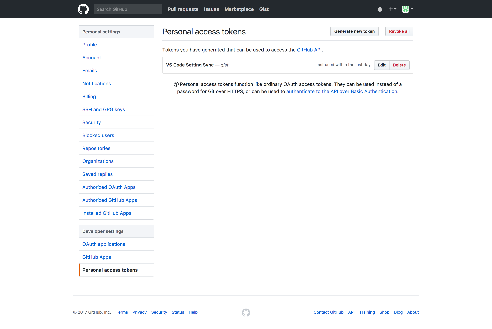
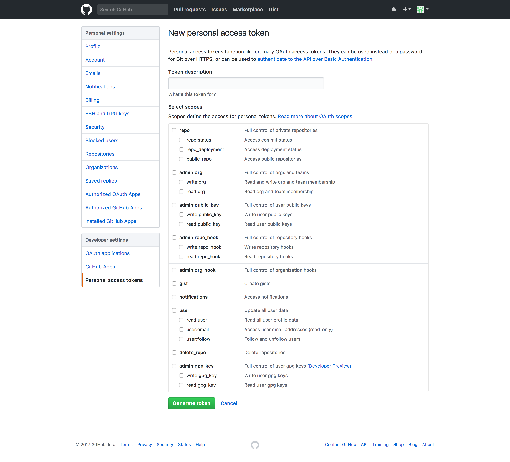
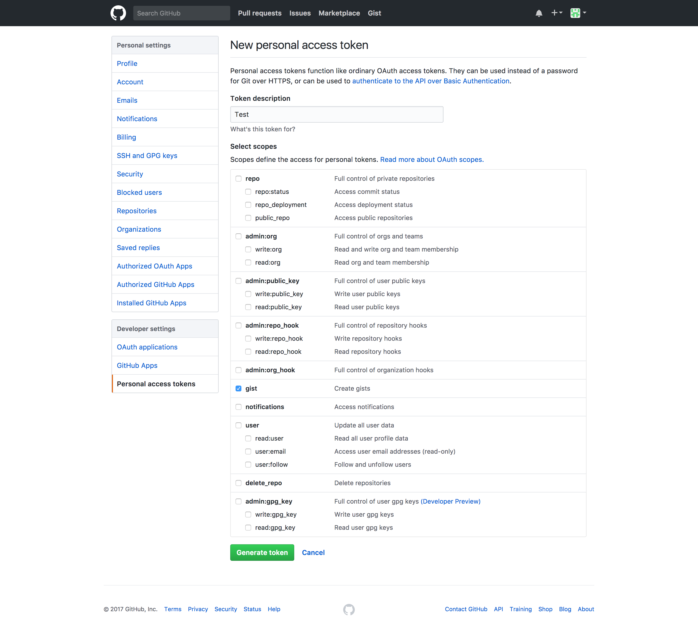
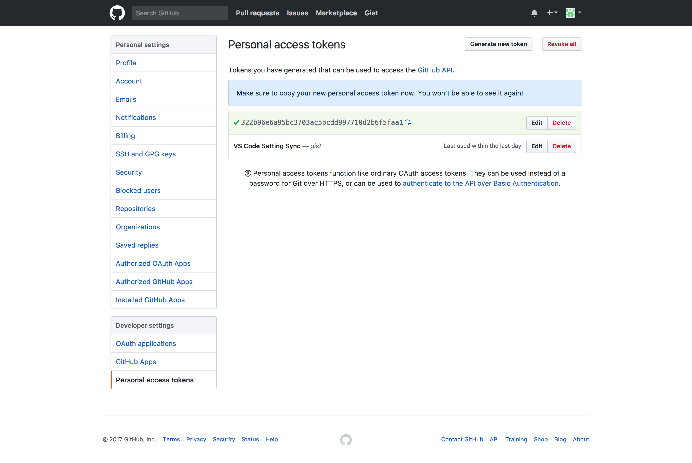
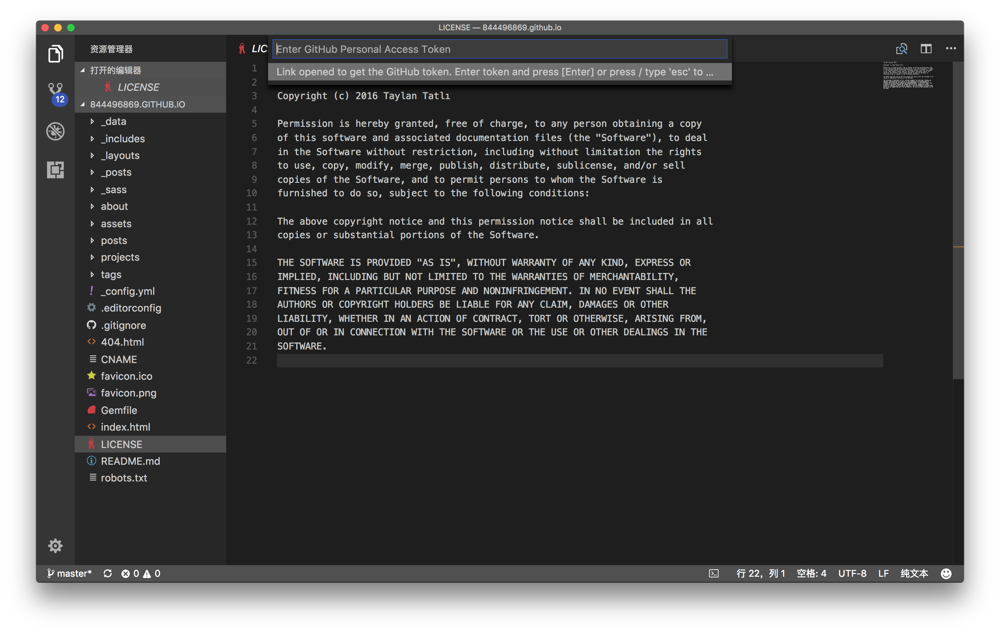
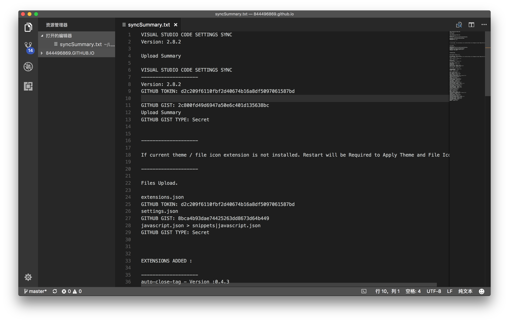
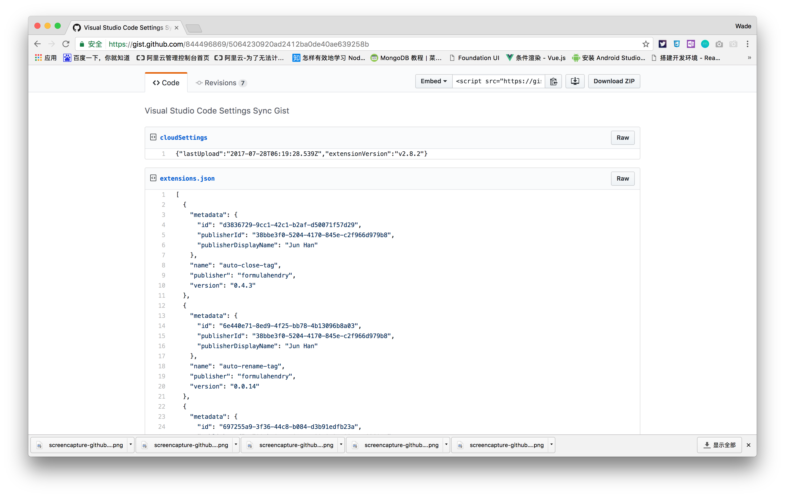

# VS Code Setting Sync插件

### 为什么使用VS Code

之前一直使用Sublime作为主要开发工具，应为Sublime有强大的插件库，大概两年前吧，也曾安装过[VS Code](https://code.visualstudio.com/),感觉那时VS Code还不是很强大，也是各种用不习惯，就卸载了。。。

### 为什么放弃Sublime转投VS Code

由于之前公司总会不停的换工作电脑，每次都要重新配置开发环境和工具，而每次安装Sublime插件时都要先使用Ctrl+ `输入一堆字符，所以每次都要去搜索如何安装插件。。

### VS Code Setting Sync

公司和家里各有台Mac，不想两边安装插件，所以使用了[Setting Sync](https://marketplace.visualstudio.com/items?itemName=Shan.code-settings-sync)插件，方便同步。
两个快捷键：

* `Shift+Alt+U` U表示upload
* `Shift+Alt+D` D表示download

### 下面介绍下如何安装和配置该插件

* 安装VS Code，根据操作系统选择对应的版本进行安装
* 安装Setting Sync插件，直接在插件列表中搜索进行安装
* 接下来就是进行配置了，首先，你得有个Github账号，登录之后，进入[设置](https://github.com/settings/profile)页面。选择[Personal access tokens](https://github.com/settings/tokens)

选择右侧Generate new token按钮

填入Token名称，这里可以填入Test,并勾选Gist选项

点击最下面Generate token按钮，生成成功之后就会看到生成的token

打开VS Code，点击快捷键`Shift+Alt+U`进行上传，这时会要求你输入刚刚申请的token，填入刚刚生产的token即可

再次输入`Shift+Alt+U`便可完成上传，上传成功之后就会看到如下界面：

上传成功后可以进入[Gist](https://gist.github.com/)查看，注意地址栏中后面的Gist ID，等再另一台设备使用`Shift+Alt+D`进行下载同步时会要求输入这个Gist ID.

这个插件可以同步工作设备上的插件，快捷键设置还有常用代码，以后再也不用担心配置开发环境。

