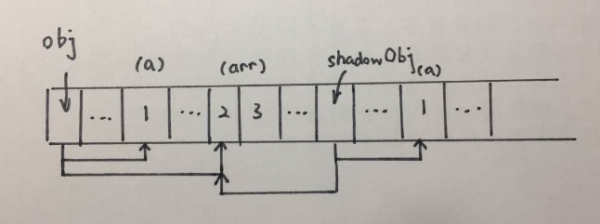
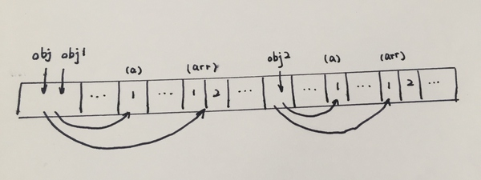

### 深拷贝和浅拷贝
谈到拷贝，JS里分为深拷贝和浅拷贝，所谓浅拷贝就是让两个或两个以上的变量指向同一个地址，如图：

深拷贝就是在内存中开辟一块区域保存一份与被拷贝对象相同的内容，如图：

这里只是大概的介绍一下概念，根据不同情况使用不同的方法进行拷贝，更详细的资料请自行搜索。

### 进入正题
上周的时候使用Vue开发一个小项目，开发过程中就遇到了数组拷贝的问题，项目中我要对一个数组进行深拷贝，根据以往经验使用underscore的clone函数或者js原生的slice(0)方法，但是发现这两个方法都不管用。修改备份的数组还是会修改之前的数组，于是就上网找资料，看看有没有一样遇到这个问题的人，所以发现了这个方法:

```javascript
JSON.parse(JSON.stringify(obj)）
```

### 对npm的好奇
作为前端开发，我想没人会不知道npm，它给前端开发人员提供了大量的工具包，插件，特别好用。于是就想我是不是也可以开发个npm包，就当熟悉下流程，所以就发布了这个只包含一个方法的npm包[wade-w](https://www.npmjs.com/package/wade-w)。

```bash
    npm install wade-w --save-dev    
```
改天有时间再写下发布一个npm包的流程，还是挺有意思的

