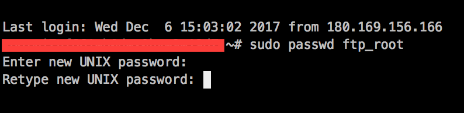
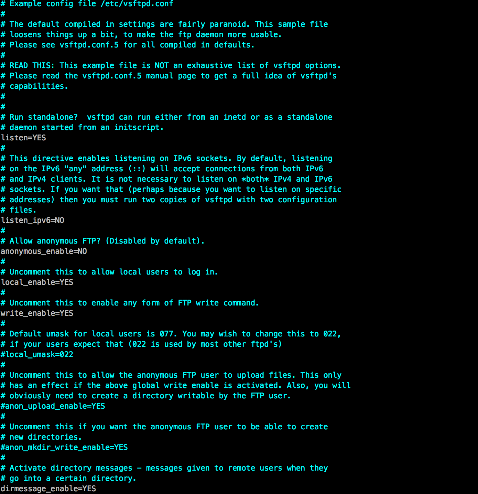
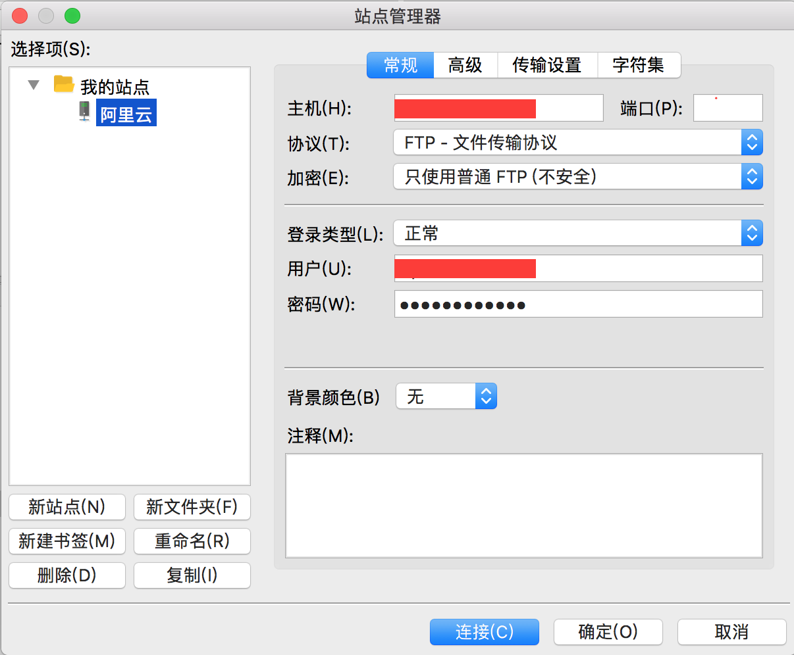
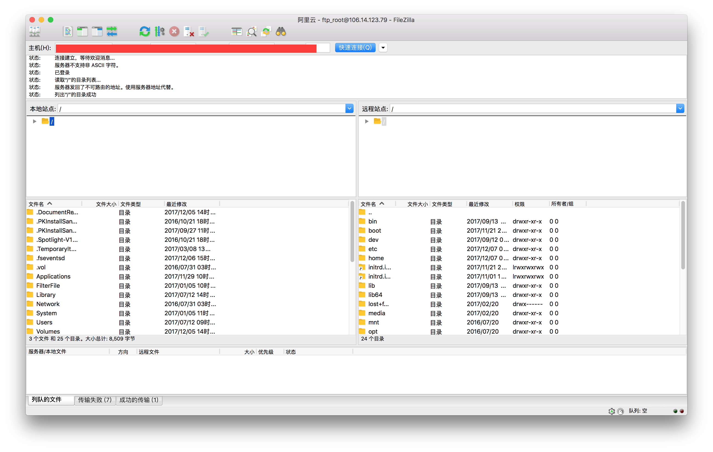

## 阿里云ECS配置FTP服务

### 安装FTP
```
sudo apt-get update

sudo apt-get install vsftpd
```
### 创建FTP文件目录并配置权限
配置权限这一步很重要，否则上传文件时会报553错误
```
sudo mkdir /home/uftp
sudo chmod -R 777 /home/uftp
```
### 创建FTP用户
```
sudo useradd -d /home/uftp -s /bin/bash "你想创建的FTP用户名"
```
### 设置FTP密码
```
sudo passwd "你的FTP用户名" 
```
会要求你输入两次密码



### 配置FTP服务
安装完成后需要对FTP服务进行相关配置，打开FTP配置文件
```
vi /etc/vsftpd.conf
```


修改或者增加如下几个字段

```
listen=YES

write_enable=YES

local_root=/home/uftp
```

## 下载和安装[Filezilla](https://filezilla-project.org/download.php?type=client)客户端

### 安装完成后进行配置

输入对应ECS的IP地址，端口号默认为21，同时输入刚刚设置的FTP用户名和密码



设置完成后点击连接按钮及可看到如下界面




至此整个配置已经完成，这时可以上传文件了，赶紧体验吧